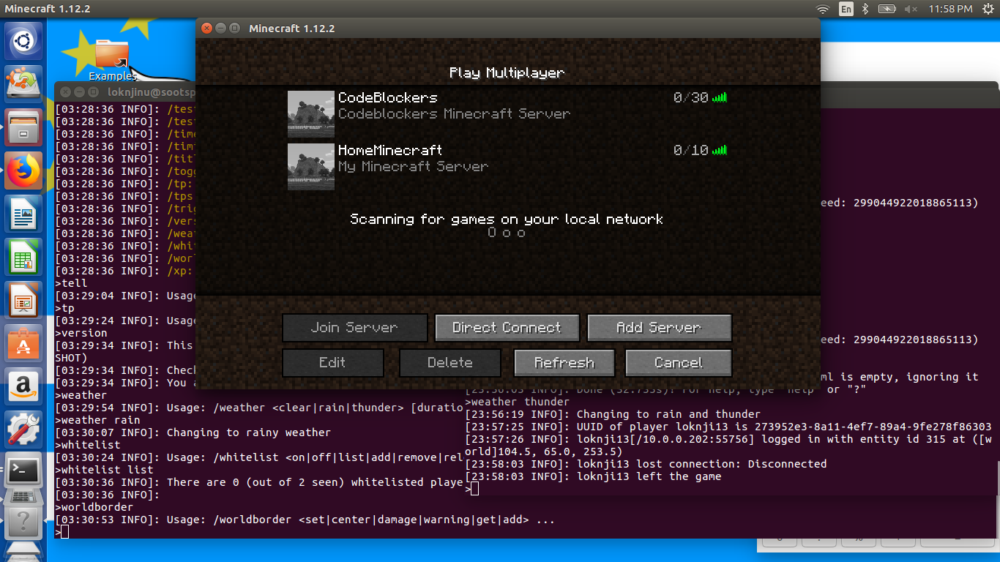
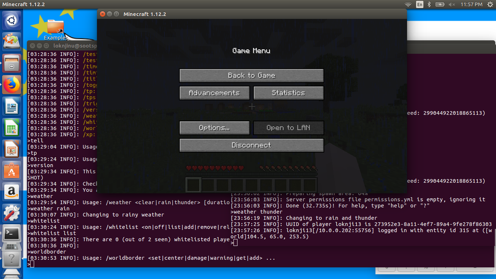
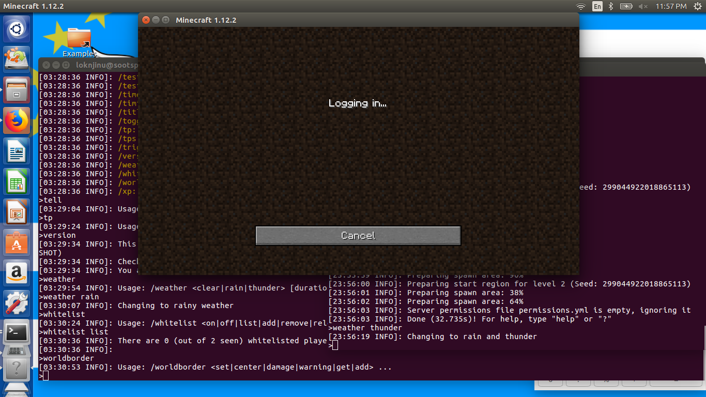
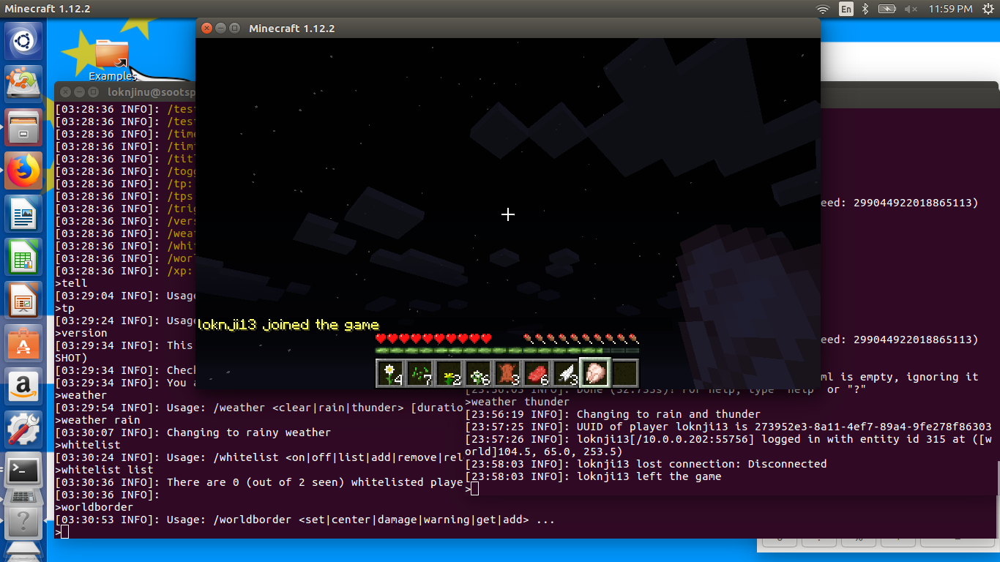
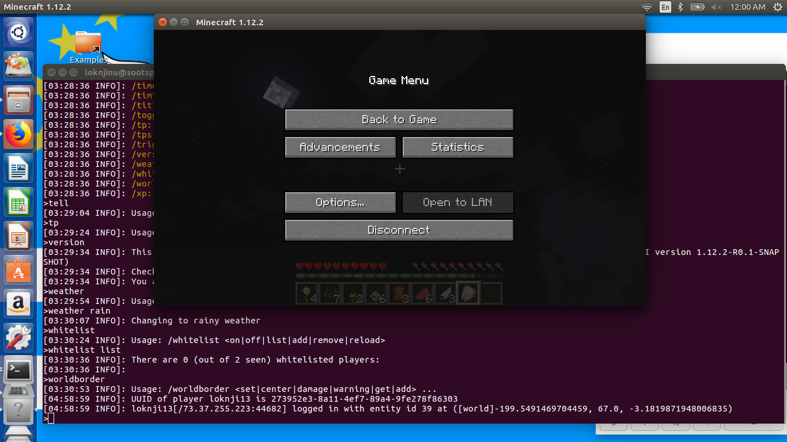

# CodeBlockers
## Week 15, Minecraft Server Installed,
### Contributions from Atanga and Team

It has been an educative ride for our team. Doing research and testing was fun but getting into difficulties was more educative as it opened up more venues for research.

We have deployed the Minecraft server on two different Linux platforms and hardware;

|		|Hardware		|Linux distribution	|Base					|
|---------------|-----------------------|-----------------------|---------------------------------------|
|1.		|Raspberry Pi 3		|Rasbian		|armv7l					|
|2.		|DigitalOcean/Server	|Ubuntu 16.04.4 LTS	|GNU/Linux 4.4.0-119-generic x86_64	|

 The following procedures will assist in building on these two platforms
**Step 1. Install script on Rasbian**
After installing your Raspbian, install GIT, _sudo apt-get install git_, then clone our [CodeBlockers project repository](https://github.com/grenack/Code-Blockers). Use the [script](https://github.com/grenack/Code-Blockers/blob/master/codeblockers.sh) and make it executable. Then launch it using _sudo ./codeblockers.sh_.

**Step 2.Install Script on Ubuntu**
After installing your Ubuntu Server, install GIT, _sudo apt-get install git_, then clone our [CodeBlockers project repository](https://github.com/grenack/Code-Blockers). Use the [script](https://github.com/grenack/Code-Blockers/blob/master/codeblockers1.sh) and make it executable. Then launch it using _sudo ./codeblockers1.sh_.

**Step 3. Launch Server**

|Platform	|Boot Directory		|Boot Command			|
|---------------|-----------------------|-------------------------------|
|Rasbian	|cd Startup		|sudo ./minecraft.sh		|
|Ubuntu Server	|cd /opt/scripts	|sudo ./codebminecraft.sh	|

**Step 4.Backups**
It is essential you create automatic backups. Ensure the location is able to store such backups.

**Step 5. Installing Minecraft Client**
Lets use our installed server as an example. In order to play on this Minecraft server, everyone will need a Mojang account to LOGIN. To obtain an account click [Here](https://minecraft.net/en-us/store/minecraft/#register). Now you have an account... You need the _Minecraft Client_ software to access!!! In your Mojang account, there are links to download for Windows, Linux and MAC users. Choose the client software that matches up with your Operating System.

Once your Client software is launched, Choose **Multiplayer** This will lead you to insert the name of the server preferably **Code_B_Minecraft**. The server address will be _167.99.232.136_. **Join The Server** and I will be on alert to Welcome you OnBoard. 
To **_chat_** while in the server, just type **T** on your keyboard.

That's it!

These are pictures of our installation and servers functioning:

Active Servers:

Pi Server:

Pi Server:

Pi Server:

SootSplash Server:

SootSplash Server:

SootSplash Server:

Both Servers:

Thanks while waiting more updates :-D

-Atanga.
